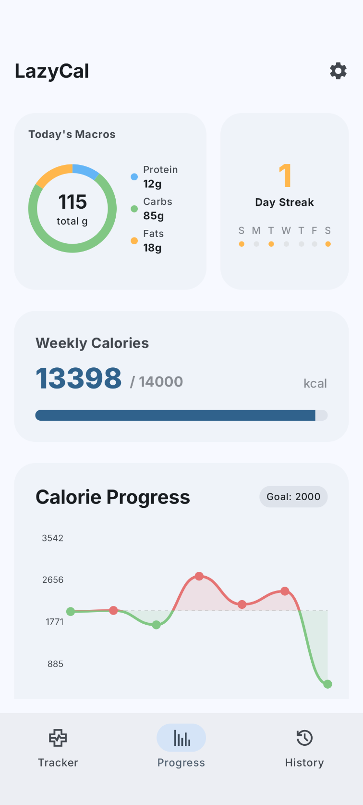
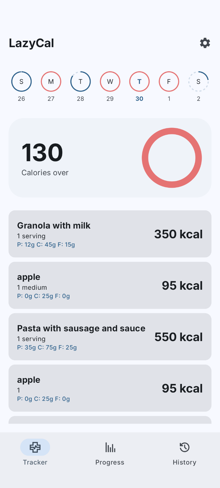
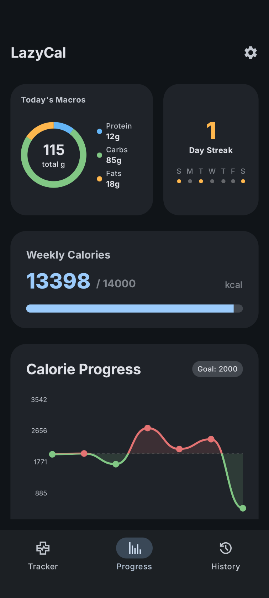
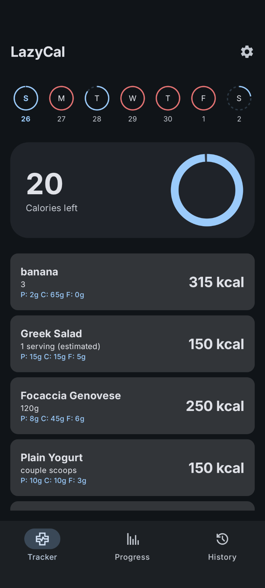

  

# Lazy Cal

**Lazy Cal** is a streamlined calorie tracking application designed for simplicity and ease of use. It leverages on-device AI (Gemma4-LiteRT) to help users log their nutrition without the friction of traditional manual entry.

## Screenshots

### Light Mode

| Progress Dashboard | Food Tracker |
| :---: | :---: |
|  |  |

### Dark Mode

| Progress Dashboard | Food Tracker |
| :---: | :---: |
|  |  |

## Features

- **AI-Powered Logging:** Quickly add meals using natural language.
- **Privacy:** AI and data are stored locally. No internet connection required. No tracking.
- **Visual Progress:** Interactive charts to monitor your caloric and macro-nutrient intake over time.
- **Daily Goals:** Set and track your daily calorie target.
- **Dark Mode Support:** Seamlessly switches between light and dark themes.
- **Export To CSV:** Export or backup your data as a csv file.
- **Manual Logging:** AI made a mistake? Manually modify any food entries.

## Installing
You can download and install the app APK from the [releases](https://github.com/froopy090/LazyCal-android/releases) page; note, however, that
the app will not auto-update. I am still pending approval from Google to upload the app onto the Play Store. I am also considering releasing the app on F-Droid.

## Contributing
LazyCal is an open source project developed by me. If you would like to contribute to my project, you are very welcome. There are multiple ways to contribute
even if you are not a developer.
- **Report bugs and suggest features.** The easiest way to contribute is to simply use the app and let me know if you find any problems or have any suggestions 
to improve it. To report a problem, please [create a new bug report](https://github.com/froopy090/LazyCal-android/issues). To request a new feature or vote on 
existing feature requests, please visit the [GitHub Discussions page](https://github.com/froopy090/LazyCal-android/discussions).
- **Spread the word.** If you like the app, share it with family and friends!
- **Write some code.** If you are an Android developer, you are welcome to contribute to the code. Currently, there are no formal guidelines since this
project is so new. However, keep in mind this project follows the [git-flow branching model](https://nvie.com/posts/a-successful-git-branching-model/). Essentially,
there are two main branches, `dev` and `master`. All development takes place in `dev`, so I expect all pull requests to branch from there. Make sure you explain the
pull request thoroughly. Once all changes in `dev` have been verified and accepted, they get merged into `master`.
- **Translate the app.** If the app is not in your native language, I happily accept translations!

## Tech Stack

- **UI:** Jetpack Compose
- **Language:** Kotlin
- **Database:** Room
- **AI Engine:** LiteRT-LM (On-device Large Language Models)
- **Architecture:** MVVM (Model-View-ViewModel)

## Building

1. Clone the repository.
2. Open the project in **Android Studio**.
3. Build and run the `:app` module.

---
*Developed with <3*
